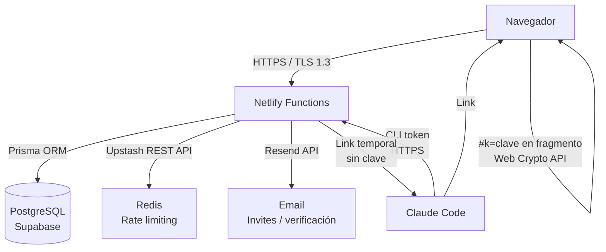

# Bóveda KF-1

Gestor de credenciales con control de acceso por links temporales e integración nativa con Claude Code.

[](https://kf1.kitifica.com)
[](https://nextjs.org)
[](LICENSE)

---

## ¿Qué es KF-1?

KF-1 es una herramienta para equipos que necesitan compartir credenciales (API keys, accesos a servicios, contraseñas de cuentas compartidas) de forma controlada, sin recurrir a WhatsApp, Slack o un spreadsheet.

En lugar de copiar y pegar secretos en conversaciones, KF-1 genera **links temporales con expiración configurable** que solo revelan la credencial a quien tiene el link completo. Cada acceso queda registrado. Cualquier link puede revocarse con un click.

## KF-1 + Claude Code

Esta es la funcionalidad diferencial del proyecto.

KF-1 incluye una **Skill para Claude Code** que permite a un agente de IA listar y acceder a credenciales sin que la contraseña llegue nunca al modelo.

### Cómo funciona

```
Usuario → Claude Code → Skill KF-1 → API de KF-1 → Link temporal
                                                          ↓
                                              Usuario abre el link
                                              en su navegador
                                                          ↓
                                         Contraseña descifrada en el cliente
```

1. El usuario activa "Acceso AI" en las credenciales que quiere exponer al agente.
2. Genera un token CLI desde el dashboard y lo configura en la Skill.
3. Claude Code puede ejecutar `/kf1 list` y `/kf1 view <id>`.
4. La Skill llama a la API de KF-1 y devuelve un link temporal (`/s/<publicId>#k=<clave>`).
5. El agente nunca ve la contraseña — solo el link. El usuario lo abre en el navegador.

### Instalación de la Skill

```bash
# Descargar la Skill
mkdir -p ~/.claude/skills/kf1
curl -sL https://kf1.kitifica.com/skill/SKILL.md -o ~/.claude/skills/kf1/SKILL.md
curl -sL https://kf1.kitifica.com/skill/kf1.sh -o ~/.claude/skills/kf1/kf1.sh

# Configurar el token CLI
bash ~/.claude/skills/kf1/kf1.sh setup
```

> **Integración actual:** solo Claude Code. La Skill usa el mecanismo de skills de Claude Code (`SKILL.md`). No hay integración con ChatGPT, Gemini, Cursor ni otros agentes en este momento.

### Ejemplo de uso

```
/kf1 list
→ Retorna: id, servicio, usuario de cada credencial con acceso AI activo

/kf1 view cm9xyz123
→ Retorna: https://kf1.kitifica.com/s/abc...#k=xyz...
→ El agente presenta el link. El usuario lo abre. La contraseña nunca pasó por el LLM.
```

---

## ¿Por qué es diferente?

| Problema | Solución habitual | KF-1 |
|----------|------------------|------|
| Compartir credenciales | Slack/email/WhatsApp | Links con expiración y auditoría |
| Dar acceso a un contratista | Cambiar contraseña después | Link revocable, sin dar la clave |
| Usar credenciales con IA | Pegar en el chat | Skill: el LLM nunca ve la contraseña |
| Saber quién accedió | No saber | Audit log con IP y timestamp |

---

## Seguridad

Todo lo documentado aquí está respaldado por el código en `src/lib/`.

### Cifrado de credenciales en reposo

- Algoritmo: **AES-256-GCM** (IV aleatorio de 12 bytes, auth tag de 16 bytes)
- Clave: variable de entorno `ENCRYPTION_KEY` (32 bytes, nunca en la DB)
- Implementación: `src/lib/crypto.ts` — `encryptAtRest` / `decryptAtRest`
- Los secretos TOTP también se cifran con el mismo mecanismo antes de guardarse

> El servidor cifra y descifra. Esto es cifrado en reposo con clave en servidor, no zero-knowledge en bóveda.

### Share links — zero-knowledge real

- Al compartir, se genera una clave efímera aleatoria (32 bytes)
- La credencial se re-cifra con esa clave (snapshot, nunca la original)
- La clave va **solo** en el fragmento de URL (`#k=base64url`)
- El fragmento no se envía al servidor en ninguna petición HTTP
- El descifrado ocurre en el navegador del destinatario con `crypto.subtle` (Web Crypto API)
- El servidor guarda solo ciphertext — no puede leer el contenido del link
- Implementación: `src/app/s/[publicId]/shared-view.tsx`

### Contraseñas de cuenta

- Hash: **scrypt** (N=32768, keylen=64 bytes, salt aleatorio de 16 bytes)
- Comparación timing-safe (`timingSafeEqual`)
- Protección contra enumeración de usuarios: `burnPasswordCompare` (costo constante aunque el usuario no exista)

### Autenticación

- Sesiones: **JWT** (NextAuth v5), cookies `httpOnly + secure + sameSite=lax`
- Passkeys/WebAuthn: soporte nativo vía NextAuth Passkey provider
- **TOTP 2FA**: RFC 6238, HMAC-SHA1, ventana de ±1 step (90s). Implementación propia en `src/lib/totp.ts`
- Códigos de backup: 10 códigos de un solo uso, almacenados como hashes scrypt

### Rate limiting

- Upstash Redis (sliding window 60s) en producción
- Fallback en memoria por instancia en desarrollo
- Aplicado a: login, registro, links compartidos
- IP real desde `x-nf-client-connection-ip` (Netlify), con fallback a XFF más a la derecha

### Auditoría

- Cada visualización, creación, revocación y denegación de acceso genera un `AuditLog`
- IP almacenada truncada: IPv4 → `/24`, IPv6 → `/48` (minimización de datos)
- Retención: 180 días, purga automática probabilística

---

## Arquitectura



**Componentes principales:**

| Carpeta | Descripción |
|---------|-------------|
| `src/app/(auth)/` | Login, registro, reset de contraseña |
| `src/app/dashboard/` | Dashboard protegido: bóvedas, credenciales, AI, equipo |
| `src/app/s/[publicId]/` | Viewer público de share links (descifrado client-side) |
| `src/app/api/` | API routes: share links, CLI tokens, audit, team |
| `src/lib/crypto.ts` | AES-256-GCM, scrypt, generación de claves |
| `src/lib/auth.ts` | NextAuth config: Credentials + Passkey |
| `src/lib/totp.ts` | TOTP/2FA, backup codes |
| `src/lib/rate-limit.ts` | Rate limiting Upstash + fallback en memoria |
| `src/lib/audit.ts` | Audit log con anonimización de IP |
| `prisma/schema.prisma` | Schema: User, Vault, Credential, ShareLink, AuditLog |
| `.claude/skills/kf1/` | Skill para Claude Code |

---

## Instalación

### Requisitos

- Node.js 20+
- PostgreSQL (local o Supabase)
- npm

### Pasos

```bash
# 1. Clonar
git clone https://github.com/kitifica-max/bovedakf-1.git
cd bovedakf-1

# 2. Instalar dependencias
npm install

# 3. Configurar variables de entorno
cp .env.example .env.local
# Editar .env.local con tus valores (ver sección Variables de entorno)

# 4. Generar cliente Prisma
npx prisma generate

# 5. Aplicar migraciones
npx prisma migrate dev

# 6. Levantar servidor de desarrollo
npm run dev
```

Abrir [http://localhost:3000](http://localhost:3000).

### Variables de entorno

Ver `.env.example` para la lista completa con descripciones.

| Variable | Requerida | Descripción |
|----------|-----------|-------------|
| `DATABASE_URL` | Sí | Connection string PostgreSQL |
| `AUTH_SECRET` | Sí | Secret para NextAuth JWT |
| `ENCRYPTION_KEY` | Sí | 64 hex chars (32 bytes) para AES-256-GCM |
| `NEXT_PUBLIC_APP_URL` | Sí | URL pública de la app |
| `RESEND_API_KEY` | Para emails | Invites, verificación, reset |
| `UPSTASH_REDIS_REST_URL` | Recomendada en prod | Rate limiting persistente |
| `UPSTASH_REDIS_REST_TOKEN` | Recomendada en prod | Rate limiting persistente |
| `ADMIN_EMAILS` | Opcional | Acceso a `/admin` |

Generar claves:

```bash
# AUTH_SECRET
openssl rand -base64 32

# ENCRYPTION_KEY
openssl rand -hex 32
```

---

## Desarrollo

```bash
npm run dev      # Servidor de desarrollo (Turbopack)
npm run build    # Build de producción
npm run lint     # ESLint
npx prisma studio  # UI para explorar la DB
```

---

## Reportar vulnerabilidades

Ver [SECURITY.md](SECURITY.md).

No abrir issues públicos para vulnerabilidades de seguridad.

---

## Transparencia

El código de KF-1 es público para que cualquier persona técnica pueda verificar cómo funciona el cifrado, la autenticación y el manejo de credenciales. Las afirmaciones de seguridad en este README corresponden directamente al código en `src/lib/`.

Si encontrás una discrepancia entre lo documentado y lo implementado, reportalo vía [SECURITY.md](SECURITY.md).

---

## License

[GNU Affero General Public License v3.0](LICENSE)

El código es libre para auditar, modificar y usar. Si operás una versión modificada como servicio, debés publicar los cambios bajo la misma licencia. Mismo modelo que [Bitwarden](https://github.com/bitwarden/server).
